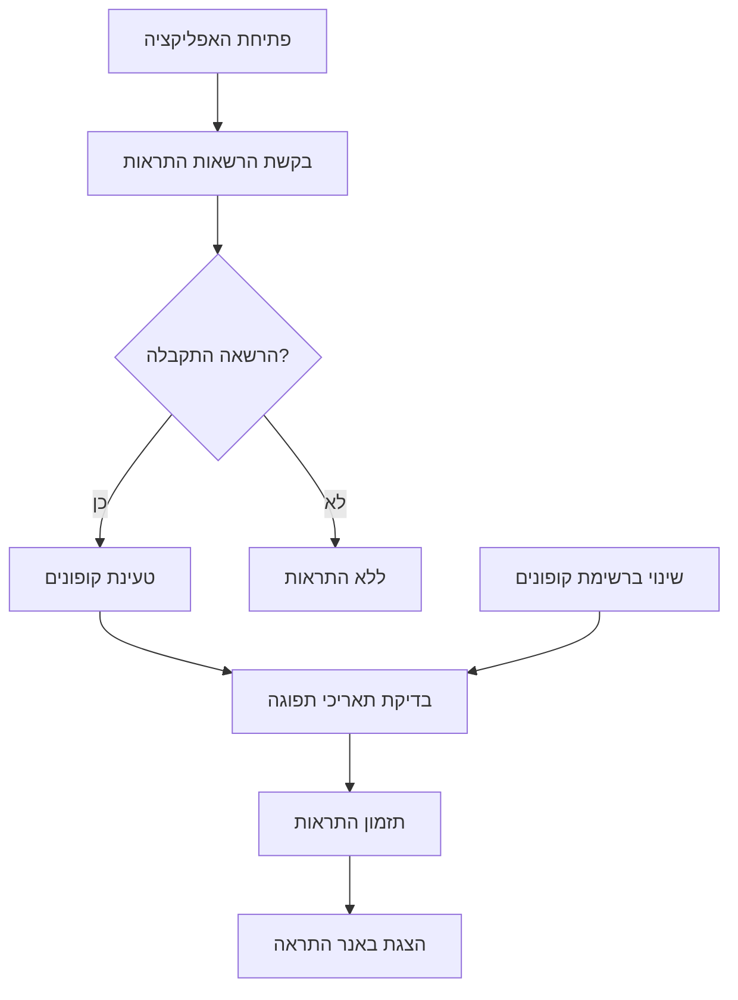

# 🔔 מערכת התראות לקופונים - תיעוד מפורט

## סקירה כללית

מערכת התראות חכמה הפועלת באפליקציית ניהול הקופונים ומתריעה למשתמשים על קופונים שעומדים לפוג תוקף.

## תכונות המערכת

### 📅 סוגי התראות

| סוג התראה | זמן | תדירות | דוגמה |
|----------|-----|---------|--------|
| **חודשית** | 30 ימים לפני תפוגה | פעם אחת | "הקופון של שופרסל יפוג תוקף באוקטובר" |
| **יומית** | 7-1 ימים לפני תפוגה | כל יום ב-10:00 | "נשארו 3 ימים לפני שהקופון יפוג" |
| **יום התפוגה** | ביום התפוגה | פעם אחת ב-10:00 | "הקופון פג תוקף היום!!!" |

### 🎯 באנר התראה חזותי

- **מיקום**: חלק עליון של המסך הראשי
- **תוכן**: עד 3 קופונים שעומדים לפוג בשבוע הקרוב  
- **פעולה**: לחיצה מעבירה לפרטי הקופון
- **אינדיקטור**: "+X עוד" אם יש יותר מ-3 קופונים

## מבנה טכני

### 📁 קבצים עיקריים

#### `NotificationManager.swift`
```swift
class NotificationManager: NSObject, ObservableObject, UNUserNotificationCenterDelegate {
    static let shared = NotificationManager()
    @Published var authorizationStatus: UNAuthorizationStatus = .notDetermined
    
    // פונקציות עיקריות:
    func requestAuthorization() async -> Bool
    func scheduleExpirationNotifications(for coupons: [Coupon])
    func updateNotifications(for coupons: [Coupon])
}
```

#### `ExpirationBanner.swift`
```swift
struct ExpirationBanner: View {
    let expiringCoupons: [Coupon]
    let onTap: (Coupon) -> Void
    
    var body: some View {
        // הצגת באנר התראה
    }
}
```

#### הרחבות ל`CouponModels.swift`
```swift
extension Coupon {
    var isExpiringInWeek: Bool {
        guard let expirationDate = expirationDate else { return false }
        let calendar = Calendar.current
        let today = Date()
        let daysLeft = calendar.dateComponents([.day], from: today, to: expirationDate).day ?? -1
        return daysLeft >= 0 && daysLeft <= 7
    }
}
```

### 🔄 זרימת עבודה



## אינטגרציה במערכת

### בשקט ה`CouponsListView.swift`:

```swift
struct CouponsListView: View {
    @StateObject private var notificationManager = NotificationManager.shared
    @State private var expiringCoupons: [Coupon] = []
    
    var body: some View {
        VStack {
            // באנר התראה
            if !expiringCoupons.isEmpty {
                ExpirationBanner(expiringCoupons: expiringCoupons) { coupon in
                    selectedCouponForDetail = coupon
                }
            }
            
            // שאר התוכן...
        }
        .onAppear {
            setupNotifications()
        }
        .onChange(of: coupons) { _ in
            updateExpiringCoupons()
            updateNotifications()
        }
    }
    
    private func setupNotifications() {
        Task {
            let granted = await notificationManager.requestAuthorization()
            if granted {
                updateNotifications()
            }
        }
    }
}
```

## הרשאות נדרשות

### `Info.plist` (אם נדרש):
```xml
<key>NSUserNotificationUsageDescription</key>
<string>האפליקציה משתמשת בהתראות כדי להזכיר לך על קופונים שעומדים לפוג תוקף</string>
```

### הרשאות שנבקשות:
```swift
center.requestAuthorization(options: [.alert, .sound, .badge])
```

## לוגיקת תזמון התראות

### 📊 אלגוריתם החישוב:
```swift
func scheduleExpirationNotifications(for coupons: [Coupon]) {
    let calendar = Calendar.current
    let now = Date()
    
    for coupon in coupons {
        guard let expirationDate = coupon.expirationDate,
              expirationDate > now,
              !coupon.isExpired,
              !coupon.isFullyUsed else { continue }
        
        let daysUntilExpiration = calendar.dateComponents([.day], from: now, to: expirationDate).day ?? 0
        
        switch daysUntilExpiration {
        case 30:
            scheduleMonthlyNotification(for: coupon, expirationDate: expirationDate)
        case 1...7:
            scheduleDailyNotifications(for: coupon, daysLeft: daysUntilExpiration, expirationDate: expirationDate)
        case 0:
            scheduleExpirationDayNotification(for: coupon, expirationDate: expirationDate)
        default:
            break
        }
    }
}
```

## תוכן ההתראות

### 🗓️ התראה חודשית:
```swift
private func scheduleMonthlyNotification(for coupon: Coupon, expirationDate: Date) {
    let monthFormatter = DateFormatter()
    monthFormatter.locale = Locale(identifier: "he_IL")
    monthFormatter.dateFormat = "MMMM"
    let monthName = monthFormatter.string(from: expirationDate)
    
    content.title = "קופון עומד לפוג תוקף החודש"
    content.body = "הקופון של \(coupon.company) יפוג תוקף ב\(monthName). כדאי לנצל אותו עד \(coupon.formattedExpirationDate)"
}
```

### ⏰ התראה יומית:
```swift
private func scheduleDailyNotifications(for coupon: Coupon, daysLeft: Int, expirationDate: Date) {
    let daysText: String
    switch daysLeft {
    case 1: daysText = "מחר"
    case 2: daysText = "נשארו יומיים"
    case 3: daysText = "נשארו 3 ימים"
    default: daysText = "נשארו \(daysLeft) ימים"
    }
    
    content.title = "קופון עומד לפוג תוקף!"
    content.body = "הקופון של \(coupon.company) יפוג תוקף \(daysText). לחץ כדי לצפות בפרטים"
}
```

### 🚨 התראת יום תפוגה:
```swift
private func scheduleExpirationDayNotification(for coupon: Coupon, expirationDate: Date) {
    content.title = "קופון פג תוקף היום!!!"
    content.body = "הקופון של \(coupon.company) פג תוקף היום! לחץ כדי לצפות בפרטים"
}
```

## ניווט והפניות

### 🎯 טיפול בלחיצות על התראות:
```swift
func userNotificationCenter(_ center: UNUserNotificationCenter, didReceive response: UNNotificationResponse, withCompletionHandler completionHandler: @escaping () -> Void) {
    let userInfo = response.notification.request.content.userInfo
    
    if let couponId = userInfo["couponId"] as? Int {
        NotificationCenter.default.post(
            name: NSNotification.Name("NavigateToCouponDetail"),
            object: nil,
            userInfo: ["couponId": couponId]
        )
    }
    
    completionHandler()
}
```

### 📱 קליטת ההפניה במסך הראשי:
```swift
.onReceive(NotificationCenter.default.publisher(for: NSNotification.Name("NavigateToCouponDetail"))) { notification in
    if let couponId = notification.userInfo?["couponId"] as? Int,
       let coupon = coupons.first(where: { $0.id == couponId }) {
        selectedCouponForDetail = coupon
    }
}
```

## בדיקה ודיבוג

### 🧪 התראות בדיקה:
המערכת כוללת התראות בדיקה שנשלחות מיד לאחר ההפעלה:

```swift
private func scheduleTestNotification() {
    let content = UNMutableNotificationContent()
    content.title = "🔔 התראות פועלות!"
    content.body = "מערכת ההתראות הופעלה בהצלחה"
    
    let trigger = UNTimeIntervalNotificationTrigger(timeInterval: 5, repeats: false)
    // נשלחת תוך 5 שניות
}
```

### 📊 הודעות דיבוג:
```swift
print("🚀 Setting up notifications...")
print("🔔 Notification permission granted: \(granted)")
print("📅 Scheduling notifications for \(coupons.count) coupons...")
print("✅ Scheduled \(scheduledCount) notifications total")
```

### 🔍 בדיקת המערכת:
1. פתח את האפליקציה
2. אשר הרשאות התראות
3. תוך 5 שניות - תגיע התראת בדיקה
4. תוך 10 שניות - תגיע התראת דמו
5. בדוק את הקונסול עבור הודעות דיבוג

## פתרון בעיות

### ❌ ההתראות לא מגיעות:
1. וודא שההרשאות אושרו על ידי המשתמש
2. בדוק שההגדרות במכשיר מאפשרות התראות
3. וודא שהאפליקציה פועלת ברקע (לא force-closed)

### ⚠️ ההתראות מגיעות באנגלית:
1. וודא שהמכשיר מוגדר לעברית
2. בדוק את הלוקליזציה בקוד
3. וודא ש-Locale מוגדר ל-"he_IL"

### 🔄 ההתראות לא מתעדכנות:
1. וודא ש-`updateNotifications()` נקראת כאשר הקופונים משתנים
2. בדוק שהתאריכים בפורמט הנכון
3. וודא שהלוגיקה של חישוב הימים עובדת נכון

## השבתת התראות

### למחיקת כל ההתראות הממתינות:
```swift
UNUserNotificationCenter.current().removeAllPendingNotificationRequests()
```

### להשבתת התראות למשתמש ספציפי:
```swift
func disableNotifications() {
    center.removeAllPendingNotificationRequests()
    authorizationStatus = .denied
}
```

## עדכונים עתידיים

### תכונות מתוכננות:
- [ ] הגדרות התראות משתמש (זמנים מותאמים אישית)
- [ ] התראות push מהשרת  
- [ ] סנקרון התראות בין מכשירים
- [ ] התראות מותנות במיקום
- [ ] אפשרות השתקת התראות לקופונים ספציפיים

### שיפורים טכניים:
- [ ] מטמון התראות לביצועים טובים יותר
- [ ] אנליטיקה על התנהגות משתמשים
- [ ] A/B testing על תוכן ההתראות
- [ ] אינטגרציה עם Analytics

---

**נוצר על ידי**: מערכת ניהול הקופונים
**תאריך עדכון אחרון**: אוקטובר 2024
**גירסה**: 1.0.0